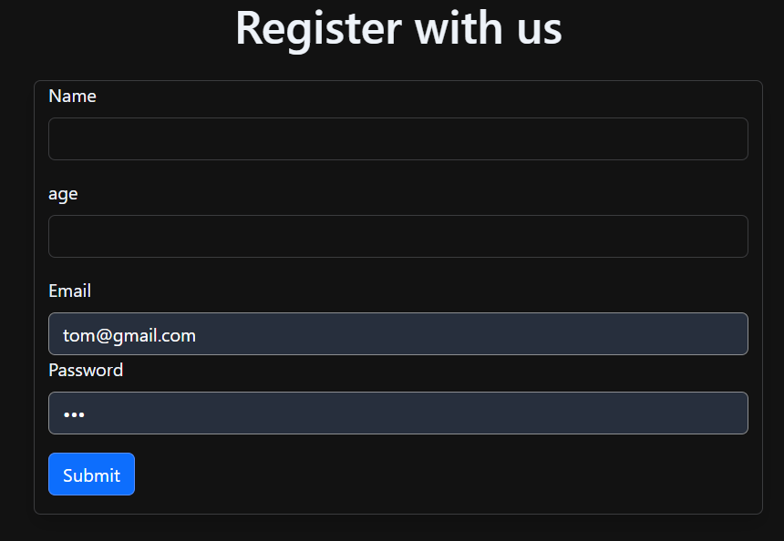
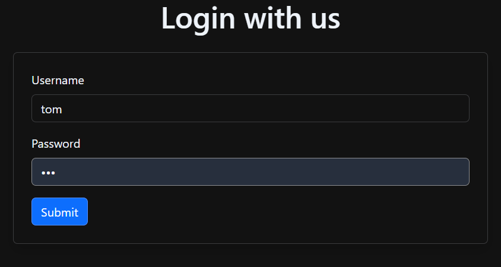
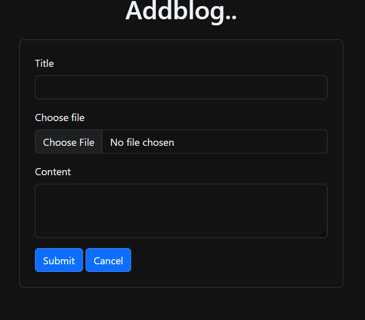
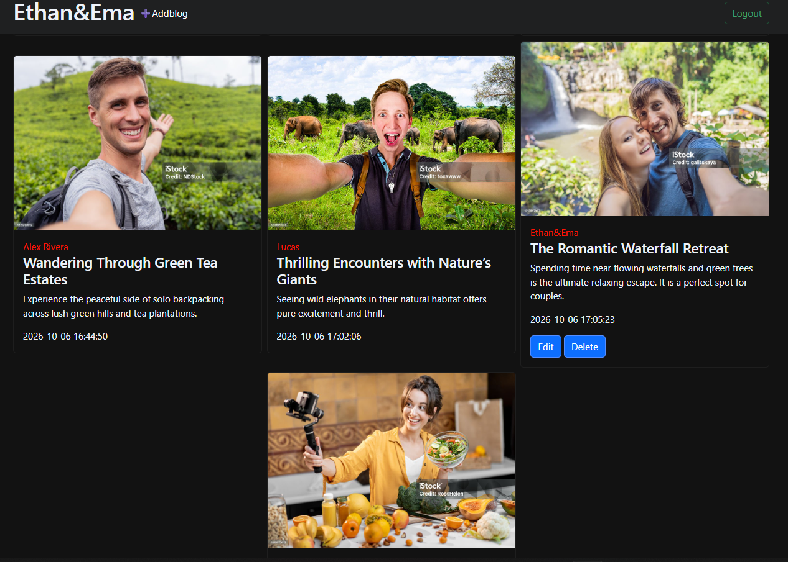

# 📝 PHP Multi-User Blog Application

A complete and secure **Blog Management System** built using **PHP, MySQL, and Bootstrap 5**[cite: 8, 9, 10]. This application allows registered users to create, publish, manage, and read blog posts with user authentication[cite: 8, 9, 13, 15].

---

## 📌 Project Description

This web application provides a platform for users to publish their blogs with custom title, content, and cover images[cite: 8]. It includes session-based authentication[cite: 8, 9, 13] and ensures that users can only edit or delete their own posts while viewing all community blogs on the dashboard[cite: 9, 11, 12].

---

## 🚀 Key Features

* 🔐 **User Registration & Login:** Secure authentication using hashed passwords (`password_hash`)[cite: 13, 15].
* 📝 **Create Blog Posts:** Upload blog posts with title, image, and detailed content[cite: 8].
* 📊 **Interactive Dashboard:** View all blogs along with author details and creation date[cite: 9].
* ✏️ **Edit & Delete Access:** Users can edit or remove their own published blogs[cite: 9, 11, 12].
* 🖼️ **Image File Uploads:** Supports custom cover images for blog posts[cite: 8, 12].
* 🔒 **Session Management:** Protected routes ensuring non-logged-in users cannot access dashboard or blog creation[cite: 8, 9, 11, 12, 14].

---

## 🛠️ Tech Stack & Dependencies

* **Language:** PHP 8.x[cite: 8, 9]
* **Database:** MySQL
* **Frontend:** HTML5, CSS3, Bootstrap 5[cite: 8, 9]
* **Server:** Apache (XAMPP / WAMP / Localhost)

---

## 📁 File Structure

```text
blog-application/
│── db.php               # Database connection script[cite: 10]
│── register.php         # User registration form & logic[cite: 15]
│── login.php            # User authentication & session start[cite: 13]
│── dashbord.php         # Main blog feed and dashboard[cite: 9]
│── addblog.php          # Form to create and publish new blog posts[cite: 8]
│── edit.php             # Edit existing blog posts[cite: 12]
│── delete.php           # Delete blog posts[cite: 11]
│── logout.php           # Destroys session and logs out user[cite: 14]
└── uplad/               # Directory to store uploaded blog images[cite: 8, 9, 12]
---
## 📷 Screenshots

### 🟢 User Registration Page


### 🔵 User Login Page


### 🔴 Add New Blog Post


### 🟣 Main Blog Dashboard



